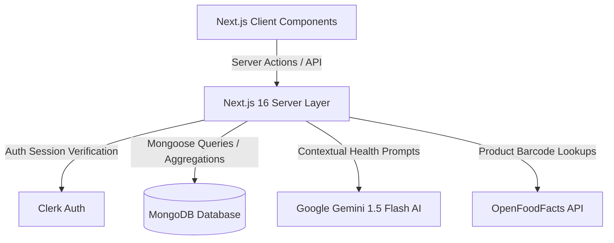
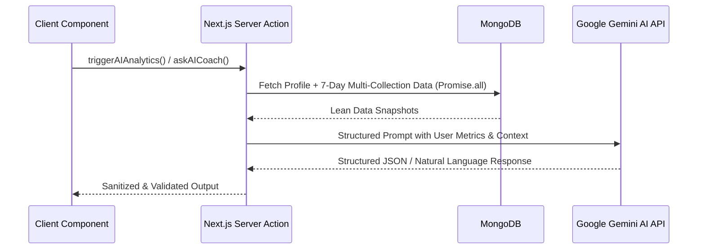

# NutriBD (FitOS) – Comprehensive Application Documentation

**Version:** 2.2.1  
**Architecture:** Next.js 16 (App Router + Turbopack), React 19, TypeScript, Mongoose 8, Clerk Authentication, Google Gemini AI  
**Author:** N. I. Nazmul (ArtistyCode Studio)  
**Repository:** [github.com/ninazmul/nutribd](https://github.com/ninazmul/nutribd)

---

## Table of Contents

1. [System Overview & Architecture](#1-system-overview--architecture)
2. [Authentication & User Lifecycle](#2-authentication--user-lifecycle)
3. [Core Application Modules](#3-core-application-modules)
   - [Dashboard & Mission Control](#31-dashboard--mission-control)
   - [Diet & Nutrition Engine](#32-diet--nutrition-engine)
   - [Workout & Strength Tracker](#33-workout--strength-tracker)
   - [Progress & Body Recomposition](#34-progress--body-recomposition)
   - [AI Health Intelligence & Coaching](#35-ai-health-intelligence--coaching)
   - [Profile & Metabolic Engine](#36-profile--metabolic-engine)
   - [Hydration & Sleep Recovery](#37-hydration--sleep-recovery)
4. [Google Gemini AI Integration Architecture](#4-google-gemini-ai-integration-architecture)
5. [Database Schema, Models & Indexing](#5-database-schema-models--indexing)
6. [Data Fetching, DSA & Performance Optimizations](#6-data-fetching-dsa--performance-optimizations)
7. [Client-Side Component & Lazy Loading Strategy](#7-client-side-component--lazy-loading-strategy)
8. [Export & Utility Infrastructure](#8-export--utility-infrastructure)
9. [Project Directory & File Structure](#9-project-directory--file-structure)
10. [Deployment & Environment Setup](#10-deployment--environment-setup)

---

## 1. System Overview & Architecture

NutriBD is a high-performance web platform designed for personal fitness, nutrition tracking, body composition analytics, and real-time AI health coaching. The application is built with a server-first architecture using Next.js App Router, executing business logic within type-safe Server Actions and storing persistent data in MongoDB via Mongoose.



### Key Architectural Principles:
1. **Server Actions First**: All data operations (CRUD, AI generation, calculations) execute as Next.js Server Actions (`lib/actions/*.ts`), ensuring client-side bundle isolation for sensitive database models and API keys.
2. **Zero Unnecessary Client JS**: Heavy charting (Recharts) and modal components are lazy-loaded on demand using `next/dynamic` with skeleton loaders.
3. **Compound Database Indexing**: Every collection features compound indexes matching actual application query patterns (e.g. `{ clerkId: 1, date: -1 }`), eliminating full table scans.
4. **Resilient Offline & PWA Support**: Configured with `@ducanh2912/next-pwa` to provide caching and offline fallbacks (`/~offline`).

---

## 2. Authentication & User Lifecycle

### Authentication Provider
The app uses **Clerk** for user authentication, supporting passwordless email login, Google OAuth, and session token verification.

### Protected Routing & Middleware
The middleware (`middleware.ts`) secures all authenticated routes under `(root)`:
```typescript
const isProtectedRoute = createRouteMatcher([
  "/((?!sign-in|sign-up|fitness-calculator|bmi-calculator|bmr-calculator|tdee-calculator|body-fat-calculator|about|ads.txt|robots.txt|sitemap.xml|manifest.webmanifest|api/uploadthing|api/barcode).*)",
]);
```

### Onboarding Flow
1. When a new user logs in, `getDashboardData()` in `dashboard.actions.ts` searches for an existing `UserProfile` record tied to `clerkId: user.id`.
2. If no profile exists, `getDashboardData()` returns `{ needsOnboarding: true }`.
3. The dashboard opens the `OnboardingModal`, prompting for age, gender, height, current weight, target weight, goal, and activity level.
4. On completion, `createOrUpdateProfile()` automatically calculates BMR, TDEE, macro distribution (calories, protein, carbs, fat, fiber, water goal) and marks `onboardingCompleted: true`.

---

## 3. Core Application Modules

### 3.1 Dashboard & Mission Control (`/`)
The main dashboard serves as the central cockpit for daily health tracking:
- **Today's Mission Card**: Dynamic contextual recommendation based on current time and missing logs (e.g., morning weight reminder, hydration milestones, post-workout recovery).
- **Daily Score (0–100)**: Granular scoring algorithm across 6 health dimensions:
  - Calorie Target ($\pm 15\%$) = 25 pts
  - Protein Target ($\ge 80\%$) = 20 pts
  - Hydration Goal ($\ge 80\%$) = 20 pts
  - Workout Logged = 15 pts
  - Sleep Logged ($\ge 6\text{h}$) = 10 pts
  - Daily Weight Logged = 10 pts
- **Smart Weight Prediction**: Linear regression forecast analyzing 30-day weight trends to project estimated goal achievement dates.
- **Stat Cards Grid**: Real-time rings and counters for Weight, Calories, Protein, Water, Workout, and Sleep.
- **Weekly Charts (Lazy-Loaded)**: `WeeklyNutritionChart` (bar chart for calories & protein) and `WeeklyWeightChart` (gradient area chart for weight fluctuations).
- **Quick Log Panels**: One-tap logging for water presets (250ml, 500ml, 1000ml) and sleep durations (6h, 7h, 7.5h, 8h).

### 3.2 Diet & Nutrition Engine (`/diet`)
- **Bangladeshi & Global Food Database**: Hundreds of curated items including traditional curries, rice, lentils, snacks, and international items.
- **Dual-Mode Portion & Gram Calculator**:
  - *Multiplier Mode*: Select $0.5\times$, $1\times$, $1.5\times$, $2\times$ servings.
  - *Gram Mode*: Input exact grams (e.g. eating 65g of a 100g base entry) with automatic proportional calculation across calories, protein, carbs, fat, and fiber.
- **Barcode Scanner**: Integrated camera scanner querying OpenFoodFacts with fallback to manual entry.
- **Natural Language AI Recipe Estimator**: Gemini-powered parser converting recipe descriptions (ingredients, cooking oil, batch weight, eaten portion) into precise macro entries.
- **Meal Classification**: Logs organized into Breakfast, Lunch, Dinner, and Snacks.
- **Saved Meals (Templates)**: Save frequent multi-item meals for instant one-tap re-logging.

### 3.3 Workout & Strength Tracker (`/workout`)
- **Session Logging**: Track split types (Push, Pull, Legs, Upper, Lower, Full Body, Cardio, Custom), duration, calorie burn, and notes.
- **Exercise & Set Detail**: Log multiple exercises per session with set numbers, reps, lifted weight, and PR flags.
- **Personal Records Engine (`getPersonalRecords`)**: Evaluates max volume ($weight \times reps$) per exercise across user history using selective projection.
- **Volume & Consistency Stats**: Calculates total volume lifted, weekly frequency against goals, and workout distribution.

### 3.4 Progress & Body Analytics (`/progress`)
- **Longitudinal Weight Trajectory**: 7, 30, and 60-day interactive area charts with moving averages and weekly delta velocity.
- **9-Point Body Measurement Tracking**:
  - Track Neck, Shoulders, Chest, Waist, Hips, Arms (Biceps), Forearms, Thighs, and Calves.
  - Historical comparison delta badges comparing latest entries to previous logs.
- **AI Goal Trajectory Forecaster**: Evaluates weekly loss/gain velocity and predicts milestone dates with plateau detection.
- **AI Body Recomposition Matrix**: Cross-references circumference shifts against scale weight changes to evaluate whether weight loss represents fat reduction or muscle preservation.

### 3.5 AI Health Intelligence & Coaching (`/analytics`)
- **AI Health Score (0–100)**: Multi-pillar performance score weighted across Nutrition (35%), Workouts (25%), Recovery (20%), and Hydration (20%).
- **Executive Coach Briefing**: Personalized weekly summary generated by Gemini AI identifying primary achievements, risks, and recommended pivots.
- **Interactive Ask AI Coach**: Context-aware chat interface pre-loaded with the user's live profile, recent nutrition logs, and workout history.
- **7-Day Action Gameplan**: Prioritized weekly action checklist.
- **Cross-Metric Correlations**: Surfaces physiological insights (e.g., impact of sleep quality on caloric intake or workout performance).

### 3.6 Profile & Metabolic Engine (`/profile`)
- **Biometric Calculations**:
  - BMI & BMI Classification.
  - Mifflin-St Jeor Basal Metabolic Rate (BMR).
  - Activity-Adjusted Total Daily Energy Expenditure (TDEE).
  - Waist-to-Hip Ratio (WHR) & Cardiovascular Risk Rating.
  - Waist-to-Height Ratio (WHtR).
  - US Navy Circumference-Based Body Fat Percentage.
  - Lean Body Mass vs. Fat Mass breakdown.
- **Adaptive Macro Adjustment**: When weight is updated in `logWeight()`, the profile automatically recalculates daily calories, protein (2.0g/kg), fat (25%), and hydration goals.

### 3.7 Hydration & Sleep Recovery
- **Hydration Tracking**:
  - Time-stamped water entry log with one-tap removal.
  - Real-time progress towards calculated weight-based hydration target (35ml/kg).
- **Sleep Tracking**:
  - Multi-session logging (night sleep + naps) with sleep time, wake time, duration, and quality ratings (1–5 stars).
  - Rolling sleep averages and recovery quality metrics.

---

## 4. Google Gemini AI Integration Architecture

All AI capabilities run on Google's `gemini-1.5-flash` model via `@google/genai` or direct API calls within secure server actions.



### Server Action Manifest:
- `lib/actions/ai-analytics.actions.ts`: Computes the comprehensive AI Health Score, Executive Briefing, Ask AI Coach conversations, and Cross-Metric Correlations.
- `lib/actions/ai-food.actions.ts`: Converts natural language recipes into macro estimations with culinary safety checks.
- `lib/actions/ai-progress.actions.ts`: Calculates goal trajectory forecasts, milestone predictions, and body recomposition analysis.
- `lib/actions/ai-profile.actions.ts`: Generates personalized longevity roadmaps and nutrient timing blueprints.

---

## 5. Database Schema, Models & Indexing

All schemas are defined using Mongoose (`lib/database/models/`). Every schema features explicit compound and text indexes tailored for application queries:

```typescript
// 1. MealLog (lib/database/models/meal-log.model.ts)
MealLogSchema.index({ clerkId: 1, date: 1, mealType: 1 }, { unique: true });
MealLogSchema.index({ clerkId: 1, date: 1 });
MealLogSchema.index({ clerkId: 1, createdAt: -1 });

// 2. Food (lib/database/models/food.model.ts)
FoodSchema.index({ name: "text" });
FoodSchema.index({ isCustom: 1, clerkId: 1 });
FoodSchema.index({ isCustom: 1, category: 1 });
FoodSchema.index({ name: 1, category: 1 });

// 3. WorkoutLog (lib/database/models/workout-log.model.ts)
WorkoutLogSchema.index({ clerkId: 1, date: -1 });
WorkoutLogSchema.index({ clerkId: 1, date: 1 });
WorkoutLogSchema.index({ clerkId: 1, "exercises.exerciseName": 1 });

// 4. WeightLog (lib/database/models/weight-log.model.ts)
WeightLogSchema.index({ clerkId: 1, date: -1 }, { unique: true });
WeightLogSchema.index({ clerkId: 1, date: 1 });

// 5. SavedMeal (lib/database/models/saved-meal.model.ts)
SavedMealSchema.index({ clerkId: 1, usageCount: -1, createdAt: -1 });

// 6. BodyMeasurement (lib/database/models/body-measurement.model.ts)
BodyMeasurementSchema.index({ clerkId: 1, date: -1, updatedAt: -1 });

// 7. WaterLog (lib/database/models/water-log.model.ts)
WaterLogSchema.index({ clerkId: 1, date: 1 }, { unique: true });

// 8. SleepLog (lib/database/models/sleep-log.model.ts)
SleepLogSchema.index({ clerkId: 1, date: 1 }, { unique: true });

// 9. UserProfile (lib/database/models/user-profile.model.ts)
UserProfileSchema.index({ clerkId: 1 }, { unique: true });
```

---

## 6. Data Fetching, DSA & Performance Optimizations

To ensure millisecond response times and eliminate N+1 query bottlenecks, the following algorithmic and data structural optimizations are implemented:

### 1. Bounded Streak Computation ($O(1)$ Hash Set Lookup)
- **Previous Bottleneck**: Unbounded query fetching every meal and workout log in database history.
- **Optimization**: Bounded to last 365 days using `{ clerkId: user.id, date: { $gte: oneYearAgoStr } }`. All logged dates are inserted into an in-memory `Set<string>`. Consecutive day streak checks run in $O(1)$ time per day.

### 2. High-Speed Personal Records Projection
- **Optimization**: `getPersonalRecords` uses MongoDB selective projection `{ "exercises.exerciseName": 1, "exercises.sets.weight": 1, "exercises.sets.reps": 1, date: 1 }` to aggregate max volume records in a single pass without loading unnecessary document properties.

### 3. Parallelized Multi-Range Weight Statistics
- **Optimization**: Resolves total entry counts, latest scale weight, and 30-day window logs in a single parallel `Promise.all` invocation, avoiding waterfall network requests.

### 4. Zero Unused Packages
- Removed `html2canvas`, `jspdf`, and `xlsx`, pruning 30+ transitive dependencies from `node_modules` and significantly reducing bundle size.

---

## 7. Client-Side Component & Lazy Loading Strategy

To optimize First Contentful Paint (FCP) and Largest Contentful Paint (LCP), heavy client modules are dynamically imported using `next/dynamic`:

| Component | File Path | Strategy | Fallback |
| :--- | :--- | :--- | :--- |
| **`WeeklyNutritionChart`** | `components/dashboard/WeeklyNutritionChart.tsx` | `dynamic(..., { ssr: false })` | Pulse Skeleton Card |
| **`WeeklyWeightChart`** | `components/dashboard/WeeklyWeightChart.tsx` | `dynamic(..., { ssr: false })` | Pulse Skeleton Card |
| **`QuickActionModal`** | `components/shared/QuickActionModal.tsx` | `dynamic(..., { ssr: false })` | None (On-demand) |
| **`OnboardingModal`** | `components/shared/OnboardingModal.tsx` | `dynamic(..., { ssr: false })` | None (On-demand) |
| **`SearchModal`** | `components/shared/SearchModal.tsx` | `dynamic(..., { ssr: false })` | None (On-demand) |
| **`AdUnit`** | `components/shared/AdUnit.tsx` | `dynamic(..., { ssr: false })` | None (On-demand) |

---

## 8. Export & Utility Infrastructure

### Zero-Dependency Native Browser Exports (`lib/export-utils.ts`)
- **CSV & Excel Export**: Formats data into standard UTF-8 CSV with byte-order mark (BOM) for native Excel compatibility, creating downloadable in-memory blobs (`URL.createObjectURL(blob)`).
- **PDF Export**: Employs native browser print engine (`window.print()`) with print stylesheets.
- **Timezone-Aware Date Handling (`lib/utils.ts`)**: Generates ISO date strings (`YYYY-MM-DD`) strictly in the user's local timezone to prevent midnight rollover misalignments.

---

## 9. Project Directory & File Structure

```
fit-os/
├── app/
│   ├── (auth)/                    # Clerk Sign-in & Sign-up routes
│   │   ├── sign-in/[[...sign-in]]/page.tsx
│   │   └── sign-up/[[...sign-up]]/page.tsx
│   ├── (root)/                    # Authenticated application routes
│   │   ├── analytics/page.tsx     # AI Health Score & Coaching
│   │   ├── diet/page.tsx          # Meal logging & barcode scanning
│   │   ├── profile/page.tsx       # Biometrics & metabolic goals
│   │   ├── progress/page.tsx      # Weight trends & body measurements
│   │   ├── settings/page.tsx      # App settings & metadata
│   │   ├── workout/page.tsx       # Workout logs & PRs
│   │   ├── layout.tsx             # Authenticated shell layout
│   │   └── page.tsx               # Main Dashboard page
│   ├── api/                       # API routes (e.g. barcode product lookup)
│   ├── globals.css                # Tailwind base styles, theme tokens, animations
│   └── layout.tsx                 # Root HTML layout with ClerkProvider
├── components/
│   ├── dashboard/                 # Lazy-loaded charts (WeeklyNutrition, WeeklyWeight)
│   ├── navigation/                # DesktopSidebar, BottomNav, TopNavbar
│   ├── shared/                    # StatCard, ProgressRing, Modals, SkeletonLoaders
│   └── ui/                        # Radix UI primitives (Button, Dialog, Tabs, etc.)
├── docs/                          # Architecture & technical documentation
├── lib/
│   ├── actions/                   # Server Actions (AI, CRUD, calculations)
│   ├── database/                  # Mongoose models & DB connection cache
│   ├── constants.ts               # App branding, versioning & global constants
│   ├── export-utils.ts            # Native export utilities (CSV / Print)
│   ├── food-portion.ts            # Dual-mode portion & gram calculator
│   ├── health-calculations.ts     # Precision BMR, TDEE, Body Fat formulas
│   ├── utils.ts                   # Date helpers & classname merger
│   └── weight-prediction.ts       # Linear regression trend analyzer
├── types/                         # TypeScript interfaces (fitness.d.ts)
├── validations/                   # Zod schemas (fitness.ts)
├── middleware.ts                  # Clerk authentication middleware
├── package.json                   # Dependencies & scripts
└── tailwind.config.ts             # Tailwind CSS configuration
```

---

## 10. Deployment & Environment Setup

### Environment Variables Checklist
Ensure the following variables are configured in `.env.local` or your production hosting environment (Vercel, Railway, AWS):

```env
# Database
MONGODB_URI=mongodb+srv://<user>:<password>@cluster.mongodb.net/nutribd?retryWrites=true&w=majority

# Clerk Auth
NEXT_PUBLIC_CLERK_PUBLISHABLE_KEY=pk_test_...
CLERK_SECRET_KEY=sk_test_...
NEXT_PUBLIC_CLERK_SIGN_IN_URL=/sign-in
NEXT_PUBLIC_CLERK_SIGN_UP_URL=/sign-up
NEXT_PUBLIC_CLERK_AFTER_SIGN_IN_URL=/
NEXT_PUBLIC_CLERK_AFTER_SIGN_UP_URL=/

# Google Gemini AI
GEMINI_API_KEY=AIzaSy...

# Public Application Metadata
NEXT_PUBLIC_SITE_URL=https://nutribd.com
```

### Production Build & Verification
```bash
# Type check and production build
npm run build

# Start production server
npm run start
```
